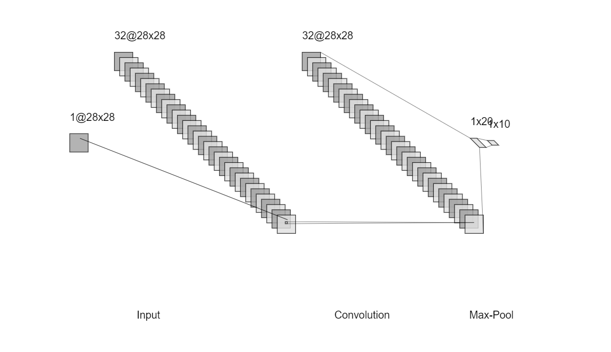
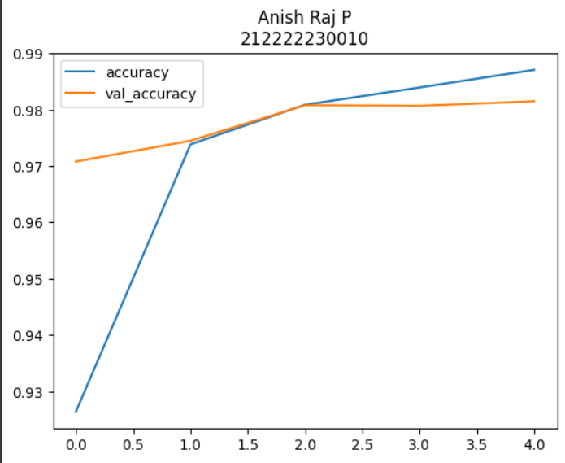
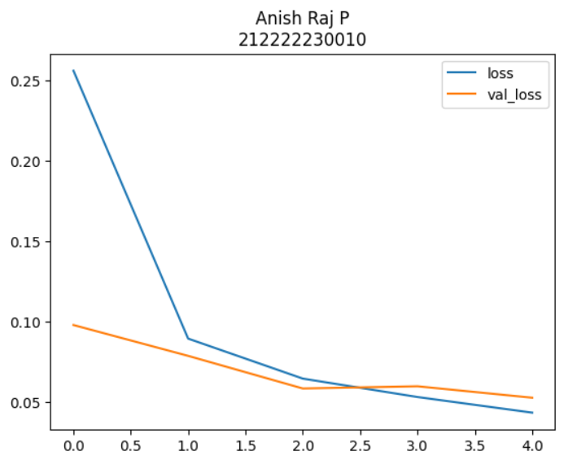
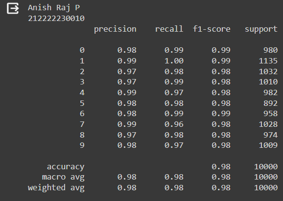
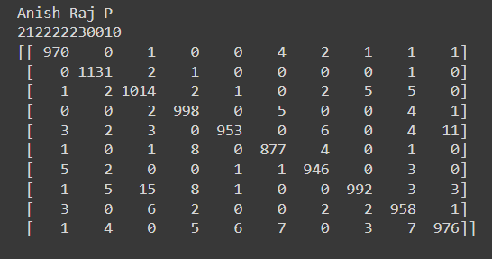
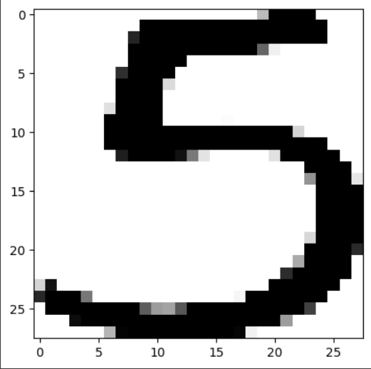
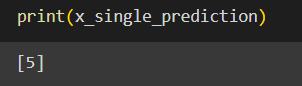

# Convolutional Deep Neural Network for Digit Classification

## AIM

To Develop a convolutional deep neural network for digit classification and to verify the response for scanned handwritten images.

## Problem Statement and Dataset
MNIST Handwritten Digit Classification Dataset is a dataset of 60,000 small square 28×28 pixel grayscale images of handwritten single digits between 0 and 9. The task is to classify a given image of a handwritten digit into one of 10 classes representing integer values from 0 to 9, inclusively.
## Neural Network Model


## DESIGN STEPS

### STEP 1:
Import tensorflow and preprocessing libraries
### STEP 2:
Build a CNN model
### STEP 3:
Compile and fit the model and then predict
## PROGRAM

### Name: Anish Raj P
### Register Number: 212222230010
```py
import numpy as np
from tensorflow import keras
from tensorflow.keras import layers
from tensorflow.keras.datasets import mnist
import tensorflow as tf
import matplotlib.pyplot as plt
from tensorflow.keras import utils
import pandas as pd
from sklearn.metrics import classification_report,confusion_matrix
from tensorflow.keras.preprocessing import image

(X_train, y_train), (X_test, y_test) = mnist.load_data()
X_train.shape
X_test.shape
single_image= X_train[0]
single_image.shape
plt.imshow(single_image,cmap='gray')
y_train.shape
X_train.min()
X_train.max()
X_train_scaled = X_train/255.0
X_test_scaled = X_test/255.0
X_train_scaled.min()
X_train_scaled.max()
y_train[0]

y_train_onehot = utils.to_categorical(y_train,10)
y_test_onehot = utils.to_categorical(y_test,10)
type(y_train_onehot)
y_train_onehot.shape
single_image = X_train[500]
plt.imshow(single_image,cmap='gray')
y_train_onehot[500]
X_train_scaled = X_train_scaled.reshape(-1,28,28,1)
X_test_scaled = X_test_scaled.reshape(-1,28,28,1)

test = keras.Sequential()
test.add(layers.Input(shape=(28,28,1)))
test.add(layers.Conv2D(filters=32,kernel_size=(3,3),activation='relu'))
test.add(layers.MaxPool2D(pool_size=(2,2)))
test.add(layers.Flatten())
test.add(layers.Dense(20,activation='relu'))
test.add(layers.Dense(10,activation='softmax'))

test.compile(optimizer='adam',loss='categorical_crossentropy',metrics=['accuracy'])
test.fit(X_train_scaled ,y_train_onehot, epochs=5,
          batch_size=64,
          validation_data=(X_test_scaled,y_test_onehot))

metrics = pd.DataFrame(test.history.history)
metrics.head()
metrics[['accuracy','val_accuracy']].plot()
plt.title("Anish Raj P\n212222230010")
metrics[['loss','val_loss']].plot()
plt.title("Anish Raj P\n212222230010")
x_test_predictions = np.argmax(test.predict(X_test_scaled), axis=1)
print("Anish Raj P\n212222230010")
print(confusion_matrix(y_test,x_test_predictions))
print("Anish Raj P\n212222230010")
print(classification_report(y_test,x_test_predictions))
img = image.load_img('five.png')
type(img)
img = image.load_img('five.png')
img_tensor = tf.convert_to_tensor(np.asarray(img))
img_28 = tf.image.resize(img_tensor,(28,28))
img_28_gray = tf.image.rgb_to_grayscale(img_28)
img_28_gray_scaled = img_28_gray.numpy()/255.0
x_single_prediction = np.argmax(
    test.predict(img_28_gray_scaled.reshape(1,28,28,1)),
     axis=1)
print(x_single_prediction)
plt.imshow(img_28_gray_scaled.reshape(28,28),cmap='gray')
img_28_gray_inverted = 255.0-img_28_gray
img_28_gray_inverted_scaled = img_28_gray_inverted.numpy()/255.0
x_single_prediction = np.argmax(
    test.predict(img_28_gray_inverted_scaled.reshape(1,28,28,1)),
     axis=1)
print(x_single_prediction)
```
## OUTPUT

### Training Loss, Validation Loss Vs Iteration Plot


### Classification Report

### Confusion Matrix

### New Sample Data Prediction


## RESULT
Thus, a convolutional deep neural network model for digit classification and to verify the response for scanned handwritten images has been implemented successfully.